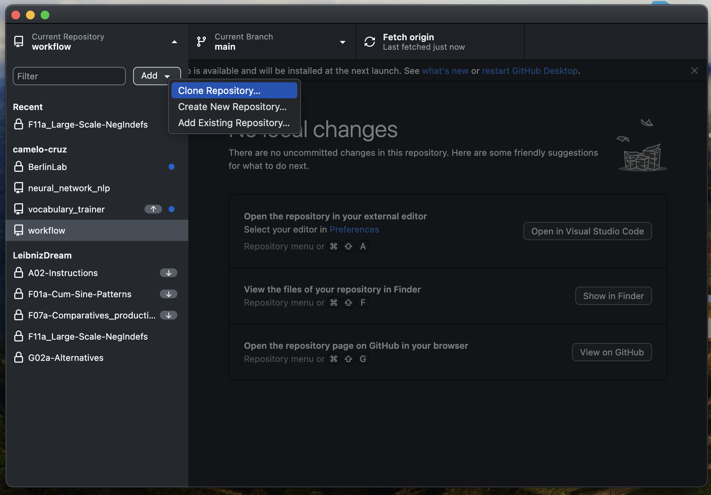
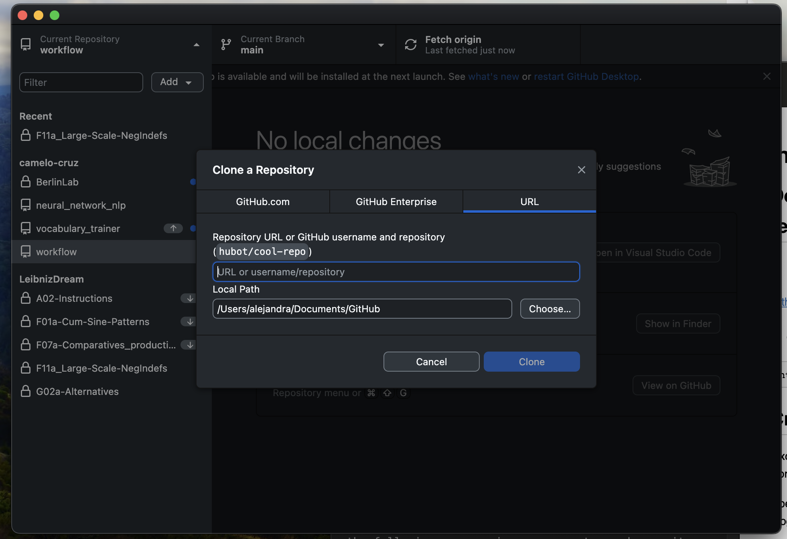
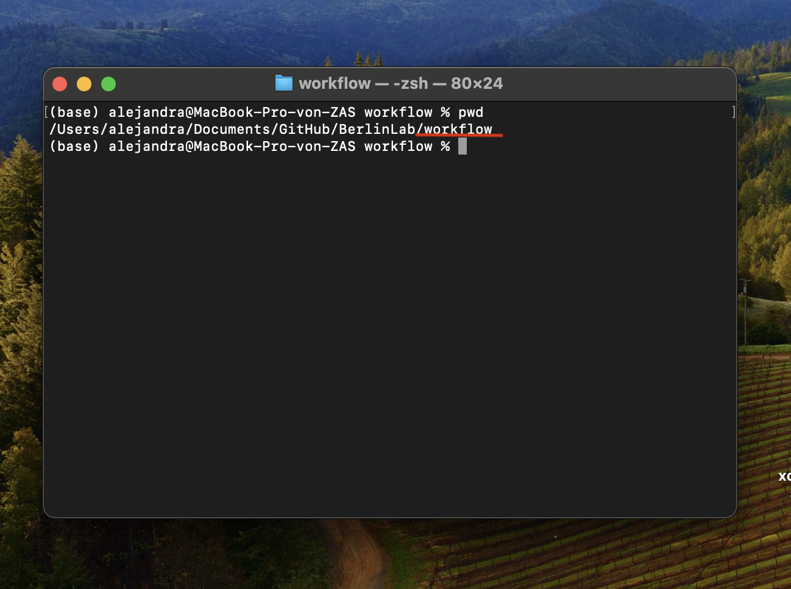
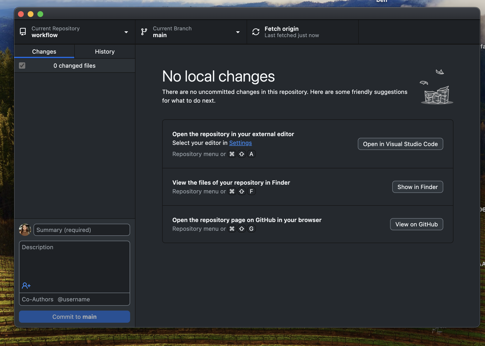

---

# Instructions to use scripts

## Index

- **[If you have not downloaded the repository yet](#if-repository-was-not-downloaded)**
  - [Download Github and Clone Repository](#download-github-and-clone-repository)
  - [Create Environment](#create-environment)
- **[If the repository was downloaded](#if-repository-was-downloaded)**
  - [Activate Environment](#1-activate-environment)
  - [Install Requirements](#install-requirements)
- [Run the Script](#2-run-the-script)
  - [For Automatic Transcription](#for-automatic-transcription)
  - [For Automatic Translation](#for-automatic-translation)
  - [For Automatic Glossing](#for-automatic-glossing)

---

## If repository was not downloaded

## Download Github and Clone Repository

### 1. Download the Github app and sign in

[Github app](https://desktop.github.com/download/)

### 2. Clone the repository using the following link:



Choose from url and copy the following path:



```
https://github.com/camelo-cruz/workflow.git
```

---

## Create Environment

:exclamation: Be sure you are in the right folder, finishing with workflow :exclamation:

Open the terminal or cmd on your computer. Look for the following program on your computer and open it:

```
cmd
```

Be sure you have ffmpeg downloaded:

```
where ffmpeg
```

if this is outputs an error, use this command and ffmpeg will be installed

```
winget install ffmpeg
```


Go to the folder of the GitHub repository. If you don't know how to do that, go to cmd and run the following command:

```
dir /S /B /AD "C:\Users\%USERNAME%\workflow"
```

This will print a path. Copy the given path and paste it:

```
cd (path)
```

To ensure that you are in the correct directory, run the following command:

```
cd
```

The output should be finishing with `workflow`. Like here:



> **Note:** Ignore this step if you have already created an environment

```
python -m venv .venv
```

## If repository was downloaded

### ⚠️ Important: Always Fetch and Pull Changes

**⚠️ ALWAYS FETCH AND PULL THE CHANGES WITH THE GITHUB APP BEFORE RUNNING ANY SCRIPT ⚠️**



---

## 1. Activate Environment

```
.venv\Scripts\activate
```

---

## Install Requirements

> **Note:** Ignore this step if you have done this before

```
pip install -r requirements.txt
```
:exclamation: This might take a while :exclamation:

---

## 2. Run the Script

### For Automatic transcription and glossing
- **Replace `[instruction]`** with the instruction of what to do: transcribe, translate or gloss 
- **Replace `[main_folder_path]`** with the path to the parent folder containing the sessions folders.
- **Replace `[language]`** with the language to transcribe. For example: German, Ukrainian.

```
python source/main.py [instruction] [main_folder_path] [language]
```

### If performing translation:

- **Replace `[translation_instruction]`** with the specific instruction to translate. If nothing is given, per default it will translate colum "latin_transcription_everything":

Options are:
  - automatic_transcription
  - corrected_transcription
  - sentences

```
python source/main.py translate [main_folder_path] [language] -i [translation_instruction]
```