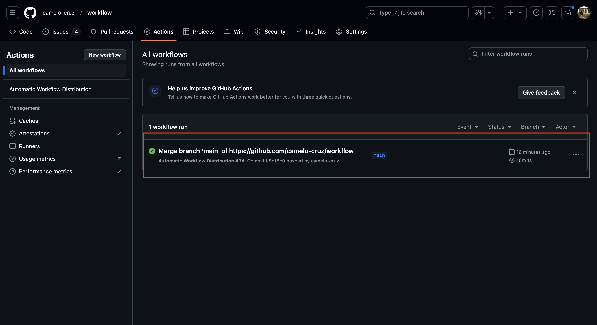
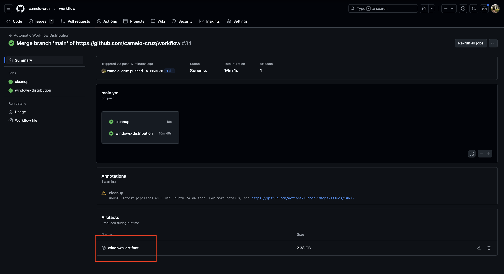

---

# Instructions to use scripts

1. Open GitHub actions

2. Click on the link that appears in the page (The name can differ):

3. Download the artifact

4. Unzip the app in the place of your preference

5. Open the app

