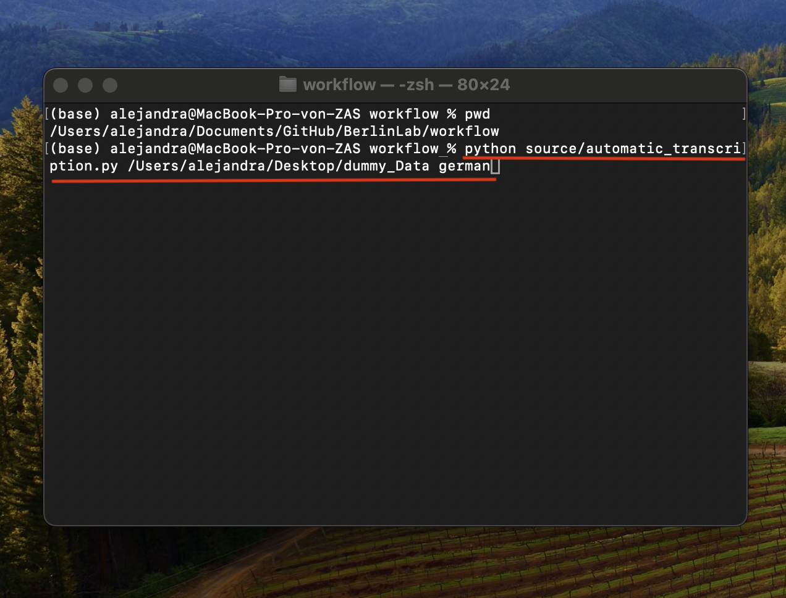

# Instructions to use scripts

:exclamation: Be sure you are in the right folder, finishing with workflow :exclamation:

For making sure of this, run the following command

```
pwd
```

the ouput shoul be finishing with workflow. Like here:


## Create environment :

> <strong>Note:</strong> Ignore this step if you have already created an environment

```
python3 -m venv .venv
```
	
## 1. Activate environment:

- in Windows:

```
.venv\Scripts\activate
```

- in Mac:

```
source .venv/bin/activate
```

##  install requirements:

> **Note:** Ignore this step if you have already created an environment

```
pip install -r requirements.txt
```

## 2. Run the script

- **For automatic transcription**
    - **Replace (main\_folder\_path)** for the path to the parent folder containing the sessions folders
    - **Replace (language)** to the language to transcribe. For example: german, ukranian

```
python source/automatic_transcription.py (main_folder_path) (language)
```

This is an example:




- **For automatic translation**


    - **Replace (main\_folder\_path)** for the path to the parent folder containing the sessions folders
    - **Replace (language)** to the language from which you want to translate. For example: german, ukranian

```
python source/automatic_translation.py (main_folder_path) (language)
```

- **For automatic glossing**